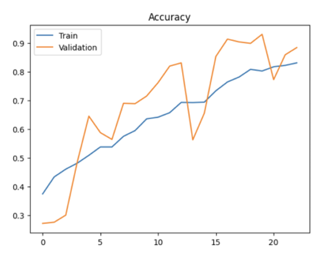
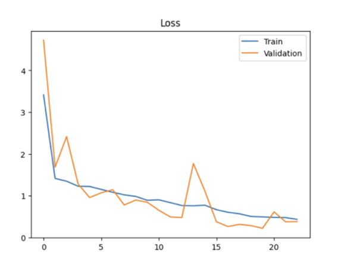

# Flower Classification Using Convolutional Neural Network (CNN)
A Convolutional Neural Network (CNN) model built with TensorFlow/Keras to perform multi-class flower classification using computer vision techniques.

## Project Overview
This project leverages Deep Learning and Computer Vision to classify various flower species automatically. By implementing a CNN, the model learns distinct features like color, texture, and shape directly from images to deliver accurate multi-class predictions.

## Key Features 

* Built a custom Convolutional Neural Network (CNN) from the ground up
* Automated data preprocessing, image rescaling, and EDA
* Enhanced stability and generalization using Batch Normalization & Dropout
* Fine-tuned training execution with Early Stopping
* Evaluated performance using Confusion Matrix, Classification Metrics, and Loss/Accuracy plots
* Included an inference pipeline for classifying unseen flower images

## Objectives

* Conduct dataset analysis and visualization
* Normalize and clean image inputs
* Build and train a custom CNN model
* Measure model efficiency through detailed performance indicators
* Perform inference on new test images

## Dataset
This project uses the Flowers Recognition Dataset available on Kaggle.
Dataset Link:
https://www.kaggle.com/datasets/alxmamaev/flowers-recognition

Dataset Characteristics
* RGB Images
* Multiple flower classes
*	Image size: 128 × 128
*	Training split: 80%
*	Validation & Testing: 20%

## Exploratory Data Analysis

EDA was performed to better understand the dataset before training.
The analysis included:
*	Class distribution visualization
*	Sample image visualization
*	Dataset balance inspection

## Data Preprocessing

The preprocessing pipeline included:
*	Image resizing (128×128)
*	Pixel normalization (1/255)
*	Data splitting
*	Data shuffling
*	ImageDataGenerator

## CNN Architecture

The implemented model consists of:
Block 1
*	Conv2D (32 Filters)
*	Batch Normalization
*	MaxPooling2D
Block 2
*	Conv2D (64 Filters)
*	Batch Normalization
*	MaxPooling2D
Block 3
*	Conv2D (128 Filters)
*	Batch Normalization
*	MaxPooling2D
Fully Connected Layers
*	Flatten
*	Dense (256)
*	Dropout (0.5)
Output Layer
*	Softmax Activation

## Model Configuration

| Parameter | Value |
| :--- | :--- |
| **Optimizer** | Adam |
| **Loss Function** | Categorical Crossentropy |
| **Metric** | Accuracy |
| **Epochs** | 25 |
| **Early Stopping** | Yes |

## Results

The CNN model achieved a test accuracy of 83.03% on unseen flower images.
The evaluation included:
*	Accuracy Curve
*	Loss Curve
*	Classification Report
*	Confusion Matrix
*	Prediction Confidence
The model demonstrated good generalization performance on unseen flower images.

## Accuracy Curve

## Loss Curve 

